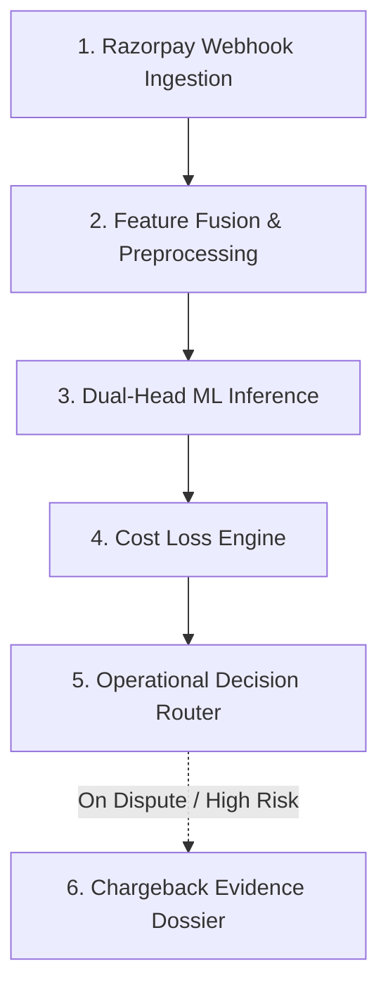
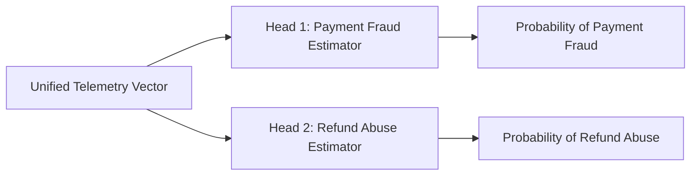

# 🛡️ ShieldPay: Dual-Head Real-Time Risk & Fraud Engine

[](https://www.python.org/)
[](https://fastapi.tiangolo.com/)
[](https://scikit-learn.org/)
[](LICENSE)

**ShieldPay** is an enterprise fintech risk management engine designed for quick-commerce platforms operating on Razorpay (e.g., Zomato, Blinkit). By fusing real-time payment gateway webhooks with merchant context and device telemetry, ShieldPay evaluates two distinct fraud vectors in sub-50ms execution time: **Pre-Fulfillment Payment Fraud** and **Post-Delivery Refund Abuse**.

---

## ⚡ Quickstart Guide (Production Setup)

Follow these steps to deploy and run ShieldPay locally in under 2 minutes:

### 1. Clone & Setup Environment

```bash
# Clone the repository
git clone [https://github.com/chanakya-b/shieldpay-risk-engine.git](https://github.com/chanakya-b/shieldpay-risk-engine.git)
cd shieldpay-risk-engine

# Create and activate virtual environment
python3 -m venv venv
source venv/bin/activate
```

### 2. Install Dependencies

```bash
pip install scikit-learn pandas numpy fastapi uvicorn joblib pydantic requests
```

### 3. Pipeline Initialization (Dataset & Models)

```bash
# Generate telemetry dataset and train dual-head ML estimators
python3 generate_zomato_dataset.py
python3 eval_metrics.py
```

### 4. Launch Production API Server

```bash
uvicorn main:app --host 0.0.0.0 --port 8000 --reload
```
* **Interactive API Docs (Swagger UI):** Visit `http://127.0.0.1:8000/docs`

### 5. Run Immediate Sanity Check

```bash
curl -X 'POST' \
  '[http://127.0.0.1:8000/api/v1/score-webhook](http://127.0.0.1:8000/api/v1/score-webhook)' \
  -H 'Content-Type: application/json' \
  -d '{
    "payment_id": "pay_TEST12345",
    "amount_inr": 3500.0,
    "payment_method": "credit_card",
    "card_network": "visa",
    "is_promo_applied": 1,
    "account_age_days": 3,
    "past_order_count": 0,
    "past_refund_ratio": 0.0,
    "orders_in_last_30mins": 5,
    "device_account_count": 3,
    "ip_to_delivery_dist_km": 85.0
  }'
```

---

## 🗺️ Interactive System Workflow



---

## 🏛️ System Architecture Deep-Dive

### <a id="1-webhook-ingestion-layer"></a>1. Webhook Ingestion Layer
* **Module:** `main.py` -> Endpoint: `POST /api/v1/score-webhook`
* **Latency Guarantee:** Sub-50ms execution budget.
* **Function:** Ingests raw JSON payloads from Razorpay payment webhooks alongside real-time client metadata. Accepts attributes including payment method, card network, order amount, and transaction velocity indicators.

---

### <a id="2-feature-fusion--preprocessing"></a>2. Feature Fusion & Preprocessing
* **Module:** `main.py` / `encoder.pkl`
* **Function:** Transforms raw categorical values (card network, payment mode) using a pre-fitted Ordinal Encoder. Combines gateway payload metrics with merchant context metrics:
  * **Device-Account Density:** Number of distinct accounts bound to the hardware signature.
  * **Geographic Discrepancy:** Geodesic distance (km) between IP geolocation and physical delivery drop-off point.
  * **Velocity Counters:** Rapid-fire order counts within 30-minute rolling windows.

---

### <a id="3-dual-head-ml-inference-engine"></a>3. Dual-Head ML Inference Engine
* **Module:** `eval_metrics.py` / `model_fraud.pkl` / `model_abuse.pkl`
* **Architecture:** Parallel `HistGradientBoostingClassifier` estimators trained to decouple fraud vectors:



* **Head 1 (Payment Fraud):** Predicts likelihood of stolen credentials, card testing, or identity theft prior to order dispatch.
* **Head 2 (Refund Abuse):** Predicts probability of post-delivery claim abuse (e.g., false "item missing" or empty-box claims) based on historical refund ratios and account age.

---

### <a id="4-cost-sensitive-loss-engine-τ"></a>4. Cost-Sensitive Loss Engine ($\tau^*$)
* **Concept:** Standard models default to an arbitrary 0.50 decision boundary. In fintech, asymmetric costs dictate that **False Negatives** (undetected fraud resulting in chargeback penalties and inventory loss) are significantly more expensive than **False Positives** (user friction during checkout).
* **Optimization Formula:** ShieldPay finds the exact optimal threshold $\tau^*$ that minimizes expected financial loss over the validation dataset:

$$\tau^* = \arg\min_{\tau \in [0, 1]} \sum_{i=1}^{N} \left[ \mathbf{1}_{\{y_i = 1, \hat{y}_i(\tau) = 0\}} \cdot \text{Cost}_{\text{FN}} + \mathbf{1}_{\{y_i = 0, \hat{y}_i(\tau) = 1\}} \cdot \text{Cost}_{\text{FP}} \right]$$

#### Financial Asymmetry Parameters
* **Payment Fraud:** $\text{Cost}_{\text{FN}} = \text{₹}2,000$ vs. $\text{Cost}_{\text{FP}} = \text{₹}300$ ($\tau^* = 0.10$)
* **Refund Abuse:** $\text{Cost}_{\text{FN}} = \text{₹}800$ vs. $\text{Cost}_{\text{FP}} = \text{₹}250$ ($\tau^* = 0.35$)

---

### <a id="5-operational-decision-router"></a>5. Operational Decision Router
* **Module:** `main.py` -> Decision Logic Matrix
* **Function:** Translates raw continuous probability scores into automated downstream operational directives:

| Vector | Probability Range | Action Triggered | Operational Impact |
| :--- | :--- | :--- | :--- |
| **Payment Fraud** | $p < 0.15$ | `AUTO_APPROVE` | Express checkout, instant kitchen dispatch. |
| **Payment Fraud** | $0.15 \le p < 0.50$ | `STEP_UP_OTP_REQUIRED` | Triggers 3DS mandatory OTP verification. |
| **Payment Fraud** | $p \ge 0.50$ | `HARD_CANCEL_TRANSACTION` | Immediate payment drop & card flag. |
| **Refund Abuse** | $p < 0.25$ | `INSTANT_REFUND_APPROVED` | Immediate bot-approved wallet refund. |
| **Refund Abuse** | $0.25 \le p < 0.50$ | `REQUIRE_UNBOXING_PHOTO_PROOF` | Requires photo proof before refund processing. |
| **Refund Abuse** | $p \ge 0.50$ | `DENY_AUTO_REFUND_ROUTE_TO_AGENT` | Blocks auto-refund; creates agent review ticket. |

---

### <a id="6-automated-chargeback-dossier-generator"></a>6. Automated Chargeback Dossier Generator
* **Module:** `evidence_generator.py` -> Endpoint: `GET /api/v1/generate-dispute-dossier/{payment_id}`
* **Function:** Automatically aggregates transaction metadata, 2FA OTP verification logs, delivery partner GPS proximity markers, and historical customer interactions into a formatted JSON representment payload ready for submission to Razorpay's Dispute API.

---

## 📊 Evaluation & Financial Benchmarks

Evaluated on a held-out test split ($N=2,000$) against standard default baselines:

| Model Head | ROC-AUC | Optimal Threshold ($\tau^*$) | Precision @ $\tau^*$ | Recall @ $\tau^*$ | Minimized Batch Loss |
| :--- | :---: | :---: | :---: | :---: | :---: |
| **Payment Fraud Head** | **0.9195** | $0.10$ | $26.80\%$ | $53.06\%$ | **₹67,300.00** |
| **Refund Abuse Head** | **0.8675** | $0.35$ | $67.41\%$ | $63.02\%$ | **₹125,750.00** |
| **Combined Gatekeeper**| **0.8671** | $0.15$ | $52.68\%$ | $74.53\%$ | **₹239,800.00** |

---

## 📜 License

This project is licensed under the [MIT License](LICENSE).