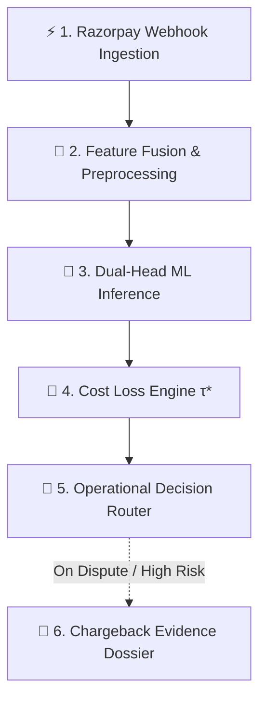
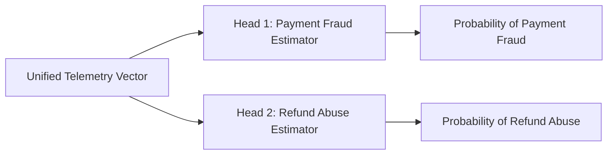

# 🛡️ ShieldPay: Dual-Head Real-Time Risk & Fraud Engine

[](https://www.python.org/)
[](https://fastapi.tiangolo.com/)
[](https://scikit-learn.org/)
[](LICENSE)

**ShieldPay** is an enterprise fintech risk management engine designed for quick-commerce platforms operating on Razorpay (e.g., Zomato, Blinkit). By fusing real-time payment gateway webhooks with merchant context and device telemetry, ShieldPay evaluates two distinct fraud vectors in sub-50ms execution time: **Pre-Fulfillment Payment Fraud** and **Post-Delivery Refund Abuse**.

---

## 🌐 Industry Context & Real-World Threat Vectors

Standard rule engines and gateway checks operate in siloes, leaving quick-commerce platforms exposed to asymmetric financial liabilities. ShieldPay addresses four pervasive, high-frequency threat vectors documented across Indian fintech and global retail ecosystems:

1. **Automated Card-Testing & Micro-Transaction Attacks:** Fraud syndicates deploy automated scripts to execute fast, low-value orders across payment gateways to validate stolen credit card dumps before executing high-value purchases. Detecting these requires real-time velocity counters and sub-minute anomaly scoring, as highlighted in [Razorpay's Fraud Analytics Architecture](https://razorpay.com/blog/what-is-fraud-analytics/).
2. **Escalating Cyber Fraud in Digital Payments:** Cybercrime reports involving digital transactions have scaled past 2.4 million complaints in India alone, totaling over ₹22,000 Crore in financial losses as tracked in [RBI Cyber Fraud Analyses](https://economictimes.indiatimes.com/industry/banking/finance/banking/rbi-is-right-to-act-on-digital-payment-fraud-but-some-safeguards-need-sharper-design/articleshow/132309496.cms). Static heuristics fail against these low-value micro-transaction attacks.
3. **Card-Not-Present (CNP) International Liability Shifts:** When processing cross-border payments, international issuing banks frequently bypass 3D-Secure (2FA / OTP) verification. When a foreign cardholder files a dispute, the merchant bears 100% of the chargeback liability plus gateway penalty fees ($15–$25 per dispute), as detailed in [Razorpay’s International Chargeback Documentation](https://razorpay.com/blog/international-payment-chargebacks-for-indian-businesses-how-to-win-prevent-and-handle-them/).
4. **Post-Fulfillment Refund & "Item Not Received" (INR) Abuse:** Post-delivery fraud represents a major loss driver, with industry benchmarks from the National Retail Federation indicating that [13.7% of all returns involve fraudulent claims](https://nrf.com/media-center/press-releases/nrf-and-appriss-retail-report-743-billion-merchandise-returned-2023). In quick-commerce, bad actors leverage multi-account rotation and device fingerprint spoofing to claim non-existent missing items or empty boxes.

---

## ⚡ Quickstart Guide

### Track 1: Instant Production Deployment (30 Seconds)
*Use pre-trained model artifacts (`model_fraud.pkl`, `model_abuse.pkl`, `encoder.pkl`) already optimized and bundled in the repository.*

```bash
# 1. Clone repository
git clone [https://github.com/chanakya-b/shieldpay-risk-engine.git](https://github.com/chanakya-b/shieldpay-risk-engine.git)
cd shieldpay-risk-engine

# 2. Setup environment & install dependencies
python3 -m venv venv
source venv/bin/activate
pip install scikit-learn pandas numpy fastapi uvicorn joblib pydantic requests

# 3. Launch production API server
uvicorn main:app --host 0.0.0.0 --port 8000 --reload
```
* **Interactive API Documentation (Swagger UI):** Visit `http://127.0.0.1:8000/docs`

#### Run Immediate Sanity Check:
```bash
curl -X 'POST' \
  '[http://127.0.0.1:8000/api/v1/score-webhook](http://127.0.0.1:8000/api/v1/score-webhook)' \
  -H 'Content-Type: application/json' \
  -d '{
    "payment_id": "pay_TEST12345",
    "amount_inr": 3500.0,
    "payment_method": "credit_card",
    "card_network": "visa",
    "is_promo_applied": 1,
    "account_age_days": 3,
    "past_order_count": 0,
    "past_refund_ratio": 0.0,
    "orders_in_last_30mins": 5,
    "device_account_count": 3,
    "ip_to_delivery_dist_km": 85.0
  }'
```

---

### Track 2: Full Pipeline Retraining & Benchmark Evaluation (Optional)
*Regenerate synthetic telemetry, re-fit ordinal encoders, and re-tune cost-sensitive decision boundaries.*

```bash
# Generate telemetry dataset and train dual-head ML estimators
python3 generate_zomato_dataset.py
python3 eval_metrics.py
```

---

## 🗺️ Interactive System Workflow



### Quick Architecture Navigation
* [1. Webhook Ingestion Layer](#1-webhook-ingestion-layer)
* [2. Feature Fusion & Preprocessing](#2-feature-fusion--preprocessing)
* [3. Dual-Head ML Inference Engine](#3-dual-head-ml-inference-engine)
* [4. Cost-Sensitive Loss Engine ($\tau^*$)](#4-cost-sensitive-loss-engine-τ)
* [5. Operational Decision Router](#5-operational-decision-router)
* [6. Automated Chargeback Dossier Generator](#6-automated-chargeback-dossier-generator)

---

## 🏛️ System Architecture & Value Rationale

### <a id="1-webhook-ingestion-layer"></a>1. Webhook Ingestion Layer
* **Module:** `main.py` -> Endpoint: `POST /api/v1/score-webhook`
* **Execution Budget:** Sub-50ms latency limit.
* **Architecture Decision:** Ingests raw JSON payloads from Razorpay payment webhooks alongside real-time client metadata. Captures payment method, card network, transaction amount, and rolling velocity counters.
* **Value Rationale:** Payment gateways only evaluate transaction parameters, whereas quick-commerce apps only evaluate cart contents. Intercepting the webhook at the backend middleware level allows ShieldPay to bridge this gap before kitchen dispatch or fulfillment occurs.

---

### <a id="2-feature-fusion--preprocessing"></a>2. Feature Fusion & Preprocessing
* **Module:** `main.py` / `encoder.pkl`
* **Architecture Decision:** Combines gateway payload parameters with merchant-side device telemetry through an `OrdinalEncoder`:
  * **Device-Account Density:** Tracks the number of distinct user accounts associated with a single hardware device ID.
  * **Geographic Discrepancy:** Calculates geodesic distance ($\text{km}$) between the user's IP address location and physical delivery drop-off coordinates.
  * **Velocity Counters:** Tracks order frequency within rolling 30-minute windows.
* **Value Rationale:** Neither gateway logs nor app logs alone contain enough signal to catch sophisticated fraudsters. Fusing payment and physical telemetry exposes proxy usage, device farming, and card-testing patterns.

---

### <a id="3-dual-head-ml-inference-engine"></a>3. Dual-Head ML Inference Engine
* **Module:** `eval_metrics.py` / `model_fraud.pkl` / `model_abuse.pkl`
* **Architecture Decision:** Decouples inference into two specialized `HistGradientBoostingClassifier` models:



* **Why Decouple into Dual Heads?** Pre-fulfillment payment fraud (e.g., stolen cards, IP proxies) and post-delivery refund abuse (e.g., false claims, high refund ratios) operate on opposing statistical distributions. A unified single-head model suffers from *negative task interference*, where optimization for payment fraud degrades refund abuse precision. Decoupling allows independent retraining, custom feature weighting, and individual loss minimization.

---

### <a id="4-cost-sensitive-loss-engine-τ"></a>4. Cost-Sensitive Loss Engine ($\tau^*$)
* **Module:** `eval_metrics.py`
* **Architecture Decision:** Standard ML models default to an arbitrary $0.50$ decision boundary designed to maximize raw accuracy or F1 score. In fintech, asymmetric costs mean **False Negatives** (undetected fraud leading to chargeback penalties and stolen inventory) are significantly more costly than **False Positives** (user friction during checkout).
* **Optimization Formula:** ShieldPay identifies the optimal threshold $\tau^*$ that minimizes total financial loss over validation data:

$$\tau^* = \arg\min_{\tau \in [0, 1]} \sum_{i=1}^{N} \left[ \mathbf{1}_{\{y_i = 1, \hat{y}_i(\tau) = 0\}} \cdot \text{Cost}_{\text{FN}} + \mathbf{1}_{\{y_i = 0, \hat{y}_i(\tau) = 1\}} \cdot \text{Cost}_{\text{FP}} \right]$$

#### Financial Asymmetry Parameters
* **Payment Fraud Head:** $\text{Cost}_{\text{FN}} = \text{₹}2,000$ vs. $\text{Cost}_{\text{FP}} = \text{₹}300 \implies \tau^* = 0.10$
* **Refund Abuse Head:** $\text{Cost}_{\text{FN}} = \text{₹}800$ vs. $\text{Cost}_{\text{FP}} = \text{₹}250 \implies \tau^* = 0.35$

---

### <a id="5-operational-decision-router"></a>5. Operational Decision Router

#### Bridging ML Thresholds ($\tau^*$) to Multi-Tiered Operations
An ML threshold ($\tau^*$) identifies the point where financial risk exceeds normal bounds. However, flat-blocking every transaction above $\tau^*$ causes unnecessary customer drop-off. ShieldPay bridges ML inference and operations using a 3-tier risk routing matrix:

1. **Frictionless Tier ($p < \tau^*$):** Risk is below cost threshold. Proceed with instant checkout or automated refund.
2. **Step-Up Verification Tier ($\tau^* \le p < \text{Hard Block Threshold}$):** Risk exceeds threshold $\tau^*$, but is not high enough to warrant an outright block. Apply targeted friction (3DS OTP challenge or photo proof requirement).
3. **Hard-Block Tier ($p \ge \text{Hard Block Threshold}$):** High-confidence fraud. Block the transaction or deny the refund to protect platform capital.

| Risk Vector | Probability Range | Operational Action | Business Impact & Design Rationale |
| :--- | :--- | :--- | :--- |
| **Payment Fraud** | $p < 0.10$ ($\tau^*$) | `AUTO_APPROVE` | Frictionless 1-click checkout for trusted users. |
| **Payment Fraud** | $0.10 \le p < 0.50$ | `STEP_UP_OTP_REQUIRED` | Triggers 3DS mandatory OTP verification to stop unauthorized card use. |
| **Payment Fraud** | $p \ge 0.50$ | `HARD_CANCEL_TRANSACTION` | Drops high-risk attempts to eliminate gateway fees and chargeback liability. |
| **Refund Abuse** | $p < 0.35$ ($\tau^*$) | `INSTANT_REFUND_APPROVED` | Instant wallet credit for legitimate customers with clean account histories. |
| **Refund Abuse** | $0.35 \le p < 0.65$ | `REQUIRE_UNBOXING_PHOTO_PROOF` | Mandates photo proof before processing claims for suspicious accounts. |
| **Refund Abuse** | $p \ge 0.65$ | `DENY_AUTO_REFUND_ROUTE_TO_AGENT` | Blocks auto-refunds and routes edge cases to human support agents. |

---

### <a id="6-automated-chargeback-dossier-generator"></a>6. Automated Chargeback Dossier Generator
* **Module:** `evidence_generator.py` -> Endpoint: `GET /api/v1/generate-dispute-dossier/{payment_id}`
* **Architecture Decision:** Automatically aggregates transaction logs, 2FA OTP verification timestamps, delivery partner GPS proximity markers, and historical account activity into a structured JSON representment payload ready for Razorpay's Dispute API.
* **Value Rationale:** Winning chargeback disputes requires submitting evidence within tight windows (often 3 business days). Automating dossier generation increases dispute recovery rates while eliminating manual operational overhead.

---

## 📊 Evaluation & Financial Benchmarks

Evaluated on a held-out test split ($N=2,000$) against standard default baselines:

| Model Head | ROC-AUC | Optimal Threshold ($\tau^*$) | Precision @ $\tau^*$ | Recall @ $\tau^*$ | Minimized Batch Loss |
| :--- | :---: | :---: | :---: | :---: | :---: |
| **Payment Fraud Head** | **0.9195** | $0.10$ | $26.80\%$ | $53.06\%$ | **₹67,300.00** |
| **Refund Abuse Head** | **0.8675** | $0.35$ | $67.41\%$ | $63.02\%$ | **₹125,750.00** |
| **Combined Gatekeeper**| **0.8671** | $0.15$ | $52.68\%$ | $74.53\%$ | **₹239,800.00** |

---

## 📜 License

This project is licensed under the [MIT License](LICENSE).